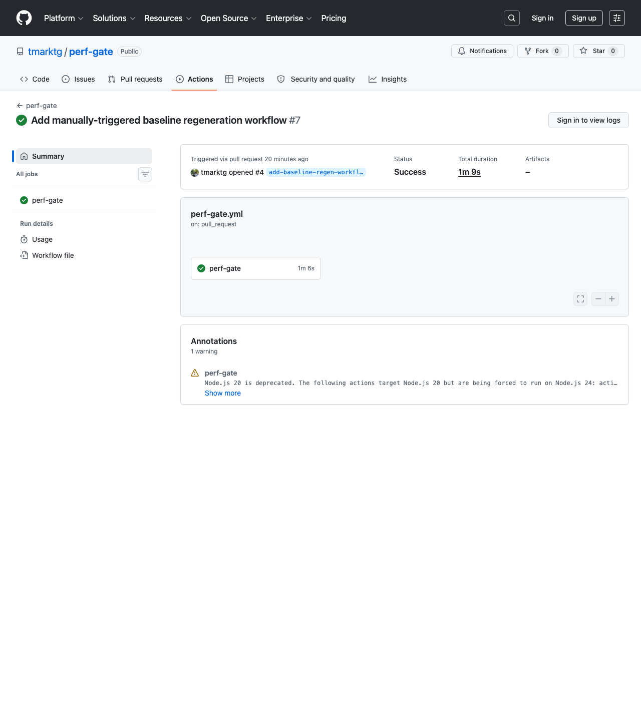
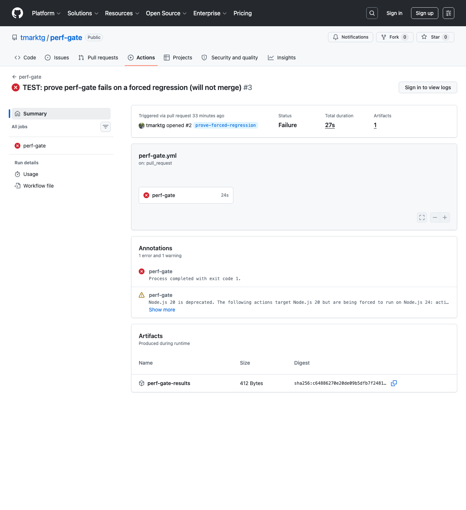

# perf-gate

[](https://github.com/tmarktg/perf-gate/actions/workflows/perf-gate.yml)

A CI job that runs standard Linux benchmarks (`sysbench`, `stress-ng`, `fio`), turns their output into structured numbers, and **fails the build when performance regresses beyond a tolerance** — while tolerating the run-to-run noise inherent to shared CI runners.

## The problem

Running a benchmark is easy. Running it *in CI* and deciding "is this a real regression or just noise?" is the hard part, because CI runners are shared, virtualized, and noisy — the same commit can vary 10–30% run-to-run on CPU-bound work with nothing changed. A naive absolute threshold (`fail if score < 5000`) flags false regressions constantly and gets muted or ignored — the classic failure mode of perf gates.

This wasn't hypothetical. Phase 2 of building this project produced a real false regression: the baseline was first captured on my Apple Silicon laptop, then the CI job ran on GitHub's `ubuntu-24.04` runner (an AMD EPYC 7763, 4 vCPUs) and correctly flagged the entire suite as failing — not because anything regressed, but because the two machines aren't comparable. That's the whole design problem in one incident: **detect a genuine regression while tolerating environmental variance, including the variance between machines you didn't choose.**

## The approach

Four independently-testable stages:

```
run_bench.sh → raw/*.txt → parse.py → results.json ─┐
                                                       ├─→ compare.py → exit 0/1
                              baseline.json (committed)┘
```

1. **`run_bench.sh`** — thin wrapper that invokes each tool with fixed, pinned parameters (thread count, duration, block size) and captures stdout to `raw/*.txt`. Determinism of *inputs* matters — a benchmark whose workload changes between runs is useless as a gate.
2. **`parse.py`** — the real engineering. Each tool has a different, ugly output format (`stress-ng` writes its metrics line to stderr; `fio`'s text summary uses lossy shorthand like `39.2k`, so it's run with `--output-format=json` instead); this normalizes all four into one schema (`§5` of [DESIGN.md](DESIGN.md)).
3. **`compare.py`** — the decision logic. Reads `results.json` + `baseline.json`, applies a **percentage tolerance band**: a metric only fails if it's worse than baseline by more than `--tolerance` (default 15%). Emits a markdown table and sets the exit code.
4. **`.github/workflows/perf-gate.yml`** — orchestrates the above and gates the PR, pinned to `ubuntu-24.04` (not `ubuntu-latest`) because a baseline is only valid for the runner class it was captured on.

### Why a wide percentage band, and not something smarter

```
regression if:  higher_is_better and value < baseline * (1 - tolerance)
             or (not higher_is_better) and value > baseline * (1 + tolerance)
```

15% is generous on purpose. A gate that cries wolf gets disabled — that's a worse outcome than no gate at all. The honest framing: *the interesting problem wasn't measuring performance, it was deciding how confident I could be that a drop was real, given the runner is shared.* I started wide and documented tighter strategies (best-of-N, statistical bands — see below) as the next iteration once there's enough variance data to justify them.

`fio`'s two metrics (`fio_randread_iops`, `fio_randread_bw_kibps`) are marked **advisory** — a CI runner's virtual disk is far noisier than its CPU, so a disk regression warns (⚠️) but doesn't fail the build; CPU and memory metrics are enforced.

## It actually works: pass and forced-fail

A real passing run on `ubuntu-24.04`:



The actual diff table from a real baseline-regeneration PR opened by `baseline.yml` — all four tools, each within a few percent of the prior baseline:

```
## Perf gate results (tolerance: 15%)

| metric                        | baseline  | current   | Δ%    | verdict |
|--------------------------------|-----------|-----------|-------|---------|
| fio_randread_bw_kibps         | 27,730.00 | 26,932.00 | -2.9% | ✅ pass |
| fio_randread_iops             | 6,932.71  | 6,733.23  | -2.9% | ✅ pass |
| stressng_cpu_bogo_ops_per_sec | 2,001.18  | 2,037.70  | +1.8% | ✅ pass |
| sysbench_cpu_events_per_sec   | 3,146.41  | 3,120.13  | -0.8% | ✅ pass |
| sysbench_memory_mib_per_sec   | 5,991.03  | 5,983.90  | -0.1% | ✅ pass |
```

And a deliberately forced regression — I hand-inflated a committed baseline on a real PR to prove the gate actually produces a red X, not just a passing local test. This is the actual run that failed in CI (before the memory/stress-ng/fio metrics existed, hence the single row):



The workflow uploads `results.json` as a build artifact on any failure (visible in the screenshot above), so a regression is debuggable without re-running anything. Reproducing the same forced-regression mechanism locally against today's full baseline, using the exact `compare.py` the CI job runs:

```
## Perf gate results (tolerance: 15%)

| metric                        | baseline | current  | Δ%     | verdict            |
|--------------------------------|----------|----------|--------|--------------------|
| sysbench_cpu_events_per_sec   | 4,680.19 | 3,120.13 | -33.3% | ❌ FAIL (regression)|
| sysbench_memory_mib_per_sec   | 5,983.90 | 5,983.90 | +0.0%  | ✅ pass            |
| stressng_cpu_bogo_ops_per_sec | 2,037.70 | 2,037.70 | +0.0%  | ✅ pass            |
| fio_randread_iops             | 6,733.23 | 6,733.23 | +0.0%  | ✅ pass            |
| fio_randread_bw_kibps         | 26,932.00| 26,932.00| +0.0%  | ✅ pass            |
```

## Regenerating the baseline

The baseline is never auto-committed from CI — raising or lowering the bar is a human decision. `.github/workflows/baseline.yml` is a manually-triggered (`workflow_dispatch`) job: it re-runs the full suite on the same `ubuntu-24.04` runner class, diffs the proposed numbers against the currently committed baseline (reusing `compare.py`), and opens a PR with that diff in the description. A reviewer merges it like any other change.

## Scope

In scope: CPU, memory, and disk-IO benchmarks via off-the-shelf tools; a parser normalizing their output; a committed baseline; tolerance-based comparison; a GitHub Actions gate.

Explicitly out of scope: cross-machine comparison (a baseline is only valid for the runner class it was captured on), a time-series dashboard, and micro-benchmarking application code — this gates the system, not a function.

## What I'd do next

- **Best-of-N runs** — run each benchmark N times, take the best result. Peak throughput is less noise-corrupted than a single sample on a contended host. Cuts false positives hard; costs CI time.
- **Statistical bands** — run N times, compute mean + stddev, flag a regression only when the new value is more than *k* standard deviations below the baseline mean. More principled than a flat percentage, more code to maintain.
- **Per-runner-class baselines** — right now there's exactly one baseline for `ubuntu-24.04`. If this ever runs on self-hosted or ARM runners, each class needs its own committed baseline; the schema's `metadata.cpu_model` / `nproc` already carry the information needed to key on that.
- **Tighten the tolerance over time** — 15% is a starting point chosen because a false-alarming gate is worse than no gate. Once there's a few weeks of run-to-run variance data, it should come down.

## Repo layout

```
perf-gate/
├── README.md
├── DESIGN.md                 ← full design doc (problem framing, schema, build order)
├── run_bench.sh               ← pinned benchmark invocations
├── parse.py                   ← raw stdout → results.json
├── compare.py                 ← results.json vs baseline.json → verdict
├── baseline.json              ← committed, human-reviewed baseline
├── raw/                       ← gitignored, benchmark stdout
├── tests/
│   ├── test_parse.py          ← unit tests against captured real output
│   └── fixtures/              ← one real raw-output sample per tool
└── .github/workflows/
    ├── perf-gate.yml          ← gates every PR
    └── baseline.yml           ← workflow_dispatch, opens a baseline-update PR
```
